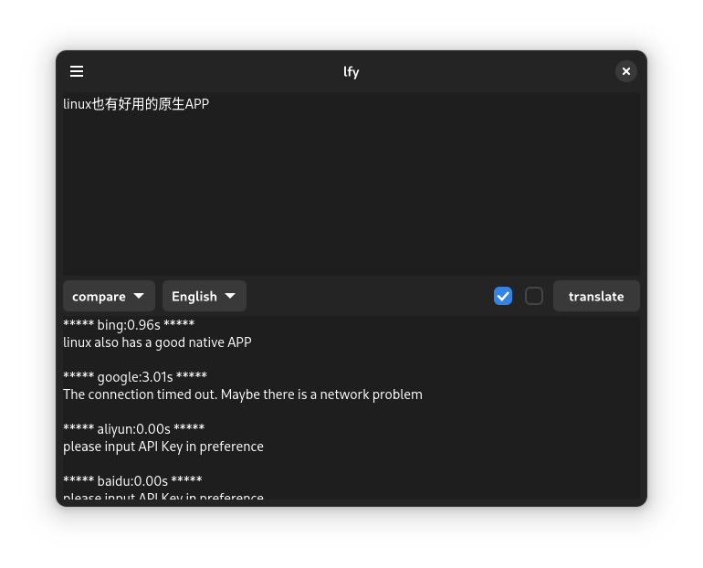
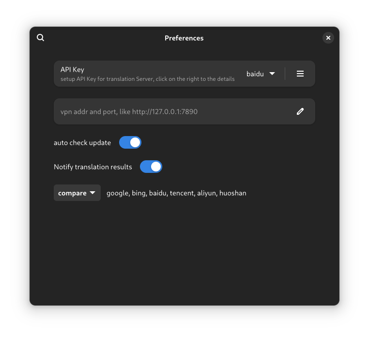
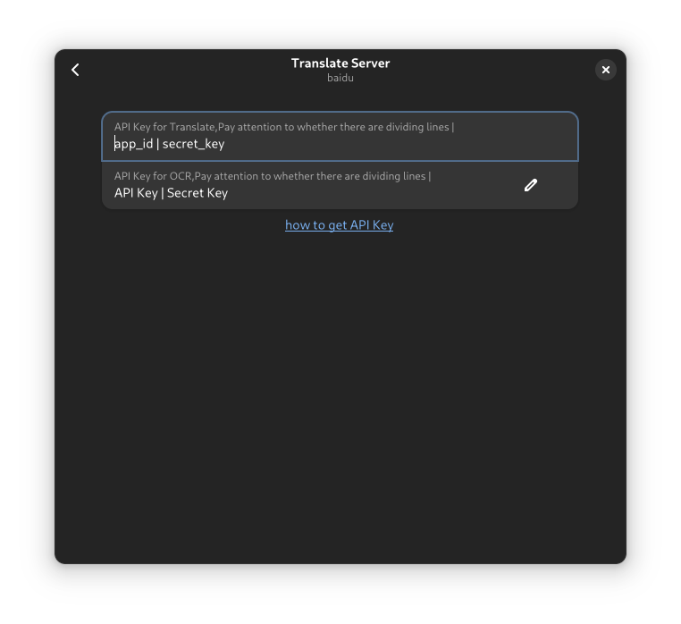
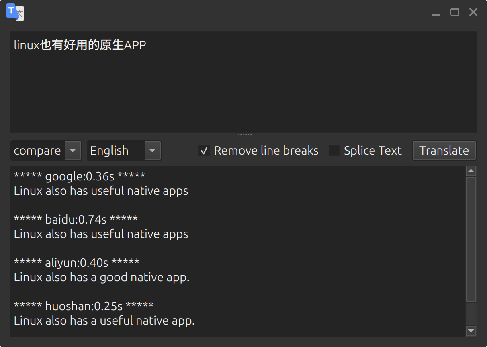
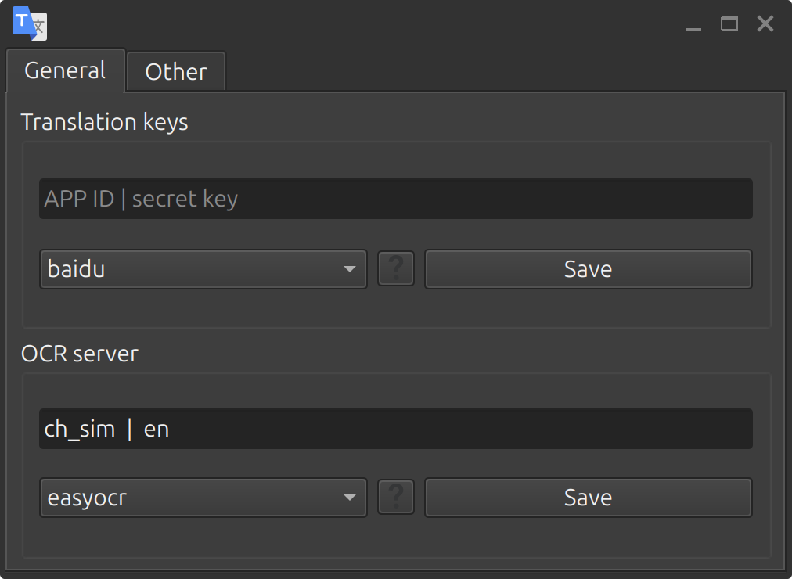
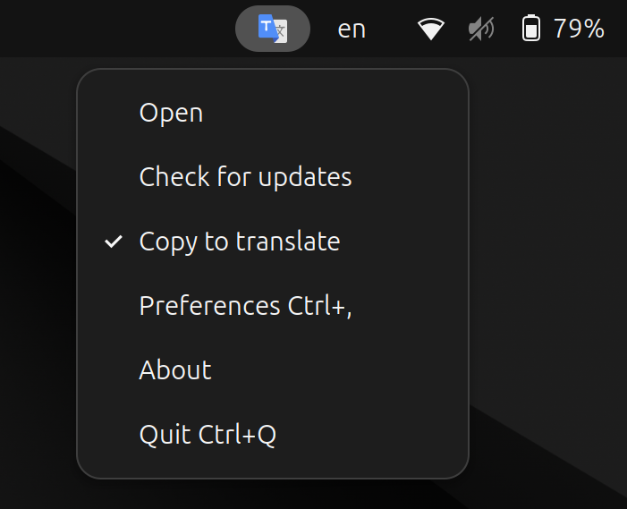

# 兰译 lfy 

此为[ldr-translate](https://github.com/yuhldr/ldr-translate) 重构版， [ldr-translate](https://github.com/yuhldr/ldr-translate) 还能用，但是不再更新，旧系统可以使用它，还是挺好用的，但是我喜欢挑战新技术。

gtk 版本

    
    
    

qt 版本

    
    
    

## 优势：

- [x] 多引擎支持
    - [bing](servers/t/bing.md)：直接使用，无需代理
    - [google](servers/t/google.md)：直接使用，需要代理
    - [百度](servers/t/baidu.md)：免费注册，填写密钥🔑
    - [腾讯](servers/t/tencent.md)：免费注册，填写密钥🔑
    - [火山](servers/t/huoshan.md)：免费注册，填写密钥🔑
    - [阿里云](servers/t/aliyun.md)：免费注册，填写密钥🔑
    - **比较**，多个服务同时翻译，对比查看
- [x] 支持截屏自动OCR识别并翻译
    - [百度](servers/o/baidu.md)：免费注册，填写密钥🔑
    - [pytesseract](servers/o/pytesseract.md)：本地服务
- [x] 提供gtk和qt原生的两个，每种多种系统打包，[这里下载](https://github.com/ldrfy/lfy/releases)
    - pip: windows11和linux测试，仅qt版本，直接终端输入 `pip install lfy` 即可安装，通过终端运行 `lfy` 即可运行，windows上国际化有些问题，需要自己设置环境变量 `LANG` `zh_CN`。
    - archlinux：已经测试，并长期使用
    - deb：ubuntu24.04 上测试
    - rpm：fedora41 上测试
    - rpm-suse：opensuse 上测试
    - flatpak：无需测试，仅gtk版本
- [x] 界面支持多国语言，使用 `gettext`
- [x] 占用极小，不到 `0.1M`
- [x] 复制，自动翻译并弹窗
- [x] gtk版本支持 `gnome` 原生 `libadwaita`，简洁、美观！
- [x] qt版本支持 kde 原生，通过pip支持所有系统，支持托盘图标。 

## 使用方法

> 有些不方便，不能直接响应快捷键、自动窗口置顶、剪贴板，应该是wayland的问题，有解决方案的话可以看 [贡献说明](CONTRIBUTE.md)

推荐在系统设置添加快捷键，自己去系统设置里，设置为 `lfy` 自定义 `快捷键`（比如 `Ctrl alt L`）

然后，每次需要翻译时，先复制翻译文本，再点 `快捷键` 即可，你可以把这个窗口右键置顶，也可以关闭

## 其他

> 我英语不好，所以开发此项目。软件界面默认英文，有中文翻译，但是文档字太多，我只写中文……，其他人可以翻译文档，包括代码中的注释，也可以翻译

- [贡献说明](CONTRIBUTE.md)

- [翻译说明](TRANSLATE.md)

- [更新说明](CONTRIBUTE.md)

## 常用资料

- [GNOME 人机界面指南](https://developer.gnome.org/hig/index.html)
- [GNOME 开发者文档](https://developer.gnome.org/documentation/index.html)
- [Gtk–4.0](https://docs.gtk.org/)
  - [Gdk–4.0](https://docs.gtk.org/gdk4/)
  - [Gio–2.0](https://docs.gtk.org/gio/)

部分代码参考：

- [gnome-music](https://gitlab.gnome.org/GNOME/gnome-music)
- [DedInc-mintrans](https://github.com/DedInc/mintrans.git)
- [dialect](https://github.com/dialect-app/dialect)
